# DIPS | Digital Identity Protection System

<p align="center">
  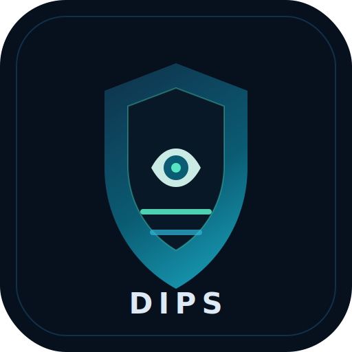
</p>


<p align="center">
  <a href="#quick-start"><strong>Quick Start</strong></a> ·
  <a href="#downloads"><strong>Downloads</strong></a> ·
  <a href="https://github.com/kely26/digital-identity-protection-system/releases/latest"><strong>Latest Release</strong></a> ·
  <a href="examples/reports"><strong>Example Reports</strong></a> ·
  <a href="#showcase-reel"><strong>Showcase Reel</strong></a> ·
  <a href="#screenshots"><strong>Screenshots</strong></a>
</p>

<p align="center">
  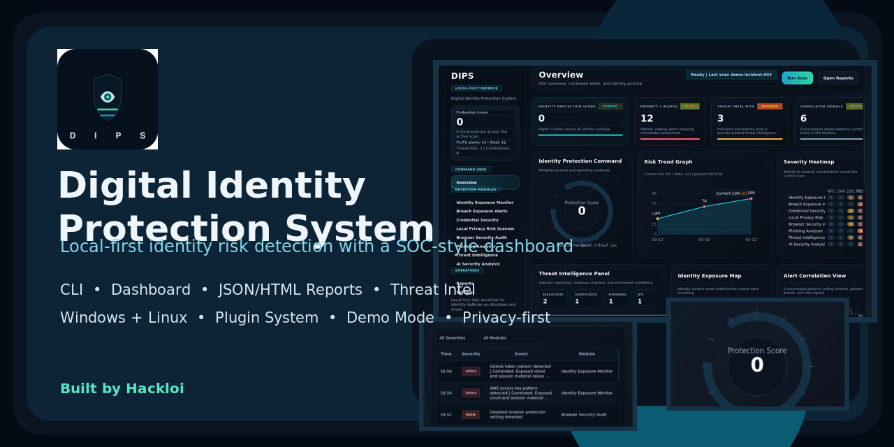
</p>

<table>
<tr>
<td valign="top">

**Local-first identity security visibility for Windows and Linux.**

DIPS is a defensive security tool for operators, privacy-conscious users, and engineers who want visibility into identity exposure, credential hygiene, local privacy leaks, risky browser posture, phishing indicators, threat intelligence matches, and cross-module risk patterns without depending on a cloud-first workflow.

It combines a production-style Python CLI, redacted JSON and HTML reports, a configurable Digital Identity Risk Score, a PySide6 desktop dashboard, a persistent security timeline, and a plugin system for external security modules.

</td>
<td valign="top" width="340">
  
</td>
</tr>
</table>

> Defensive-only. DIPS does not exploit systems, weaponize findings, or decrypt protected browser vaults.

## Beta Access

DIPS is ready for a free early-access beta with stable core workflows and support-oriented diagnostics.

Recommended beta workflow:

- run `dips doctor` before the first scan
- use `dips scan` normally for everyday evaluation
- include redacted `dips doctor --doctor-format json` output when filing issues
- use [beta feedback](.github/ISSUE_TEMPLATE/beta_feedback.md) or the normal bug template for support

## Project Snapshot

- **Tagline:** Local-first identity risk detection with a SOC-style desktop dashboard.
- **GitHub description:** Cross-platform defensive security platform for identity exposure detection, breach intelligence, phishing analysis, and privacy-risk reporting.
- **Who it is for:** security engineers, blue-team builders, privacy-focused operators, and recruiters looking for strong Python security engineering work.
- **Why it stands out:** the repository combines CLI engineering, modular analysis pipelines, secure-by-default reporting, desktop UX, plugin extensibility, and release-ready packaging in one coherent project.

## Why DIPS

- Local-first scanning with optional provider integrations instead of mandatory cloud telemetry.
- Cross-platform support for Windows and Linux from the same codebase.
- Professional runtime surface: typed config, structured logging, tests, CI, reports, dashboard, and plugin architecture.
- Privacy-respecting defaults: redacted reports, hashed breach identifiers, bounded local caches, and graceful failure handling.
- Modular design that supports new scanner modules, report extensions, and defensive workflows without rewriting the core engine.

## Key Features

- Identity Exposure Scanner for emails, tokens, secrets, private-key markers, and risky plaintext artifacts.
- Breach Intelligence module with hashed identifier lookup, offline breach datasets, provider abstraction, and local caching.
- Credential Hygiene analysis for weak passwords, common-password matches, reuse, and identifier-based password weakness.
- Local Privacy Risk scanning for exported credentials, shell history exposure, permission issues, and risky local stores.
- Browser Security Audit for Chromium-family and Firefox profiles, saved-session indicators, unsafe settings, and extension sprawl.
- Email and Phishing Analyzer for suspicious links, header anomalies, authentication failures, urgent lures, and risky attachments.
- Threat Intelligence enrichment for URLs, domains, and IPs with local feeds, optional online lookups, and IOC correlation.
- AI Security Analysis for plain-language summaries, risk explanations, suspicious-pattern detection, and remediation advice.
- Security Event Timeline and alert correlation across modules and across repeated scans.
- JSON and HTML reporting designed for both automation and analyst review.
- Runtime diagnostics with `dips doctor` for operator support and beta rollout verification.
- Policy-gated scan exits for automation workflows and managed-service enforcement.
- Premium PySide6 dashboard with SOC-style panels, scan history, trend charts, severity heatmaps, and report loading.
- Plugin System for external scanners, enrichment hooks, report extensions, and local tool integrations.

## Engineering Highlights

- Professional Python package with typed configuration, release metadata, build artifacts, and documented maintainer workflows.
- Security-focused architecture with redaction, bounded local caches, defensive file handling, and graceful error boundaries.
- Extensible runtime model that separates built-in scanners, advanced modules, plugins, risk scoring, and reporting.
- Portfolio-quality desktop UX with demo mode, screenshot-ready states, and SOC-style telemetry panels.
- Contributor-friendly repo surface with focused docs, examples, templates, changelog structure, and release guidance.

## Showcase Reel

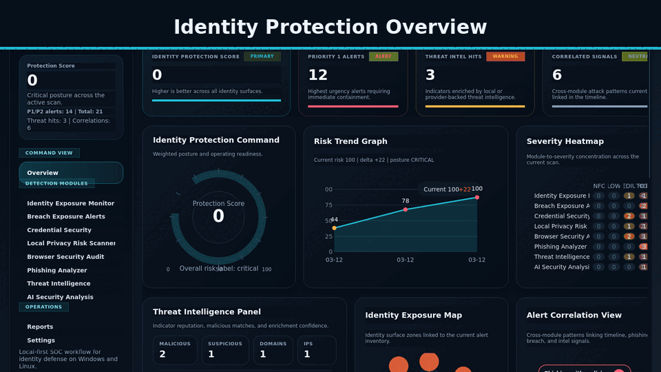

## Screenshots

Overview dashboard:

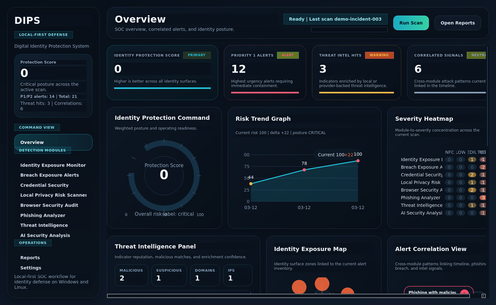

Risk score panel:

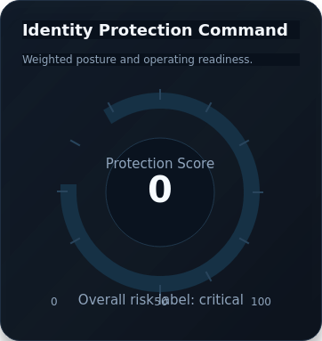

Severity distribution:

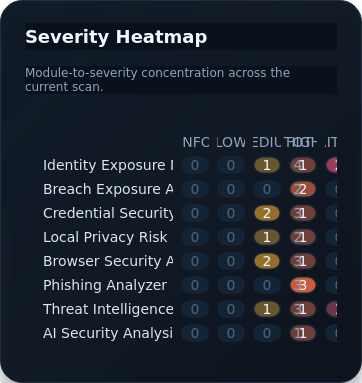

Security event timeline:

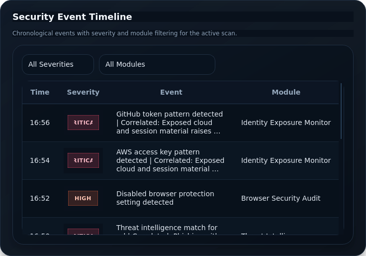

Breach exposure alert view:

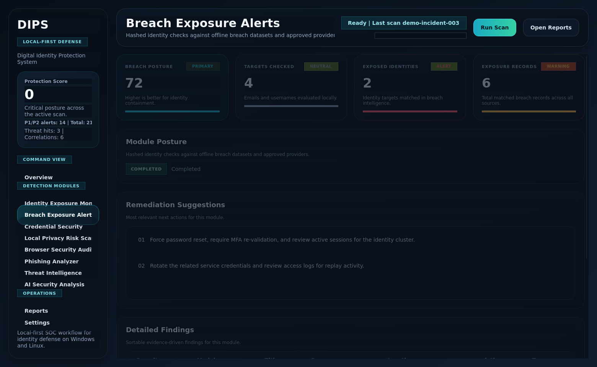

Scan report view:

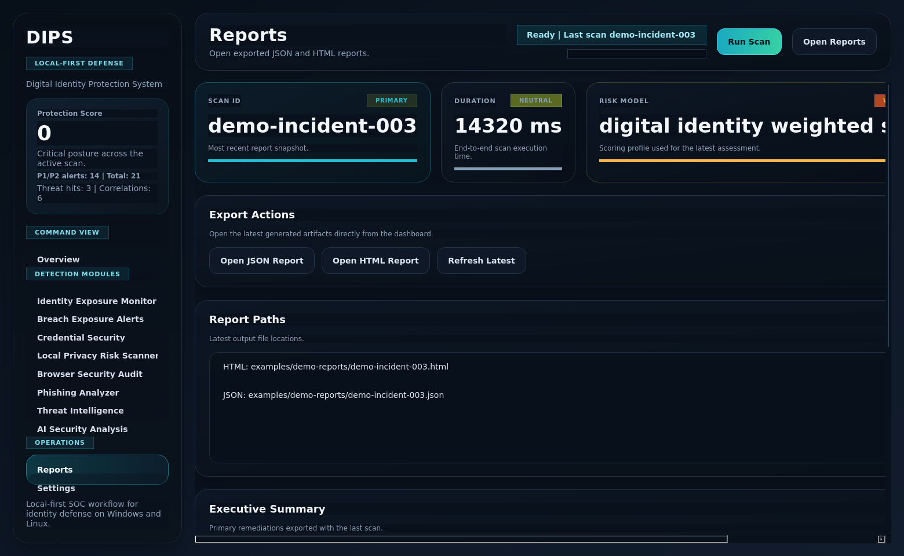

Identity exposure analysis:

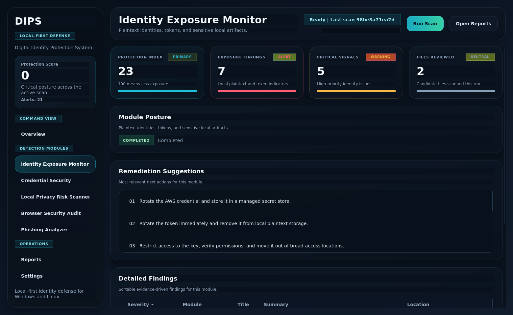

Threat intelligence panel:

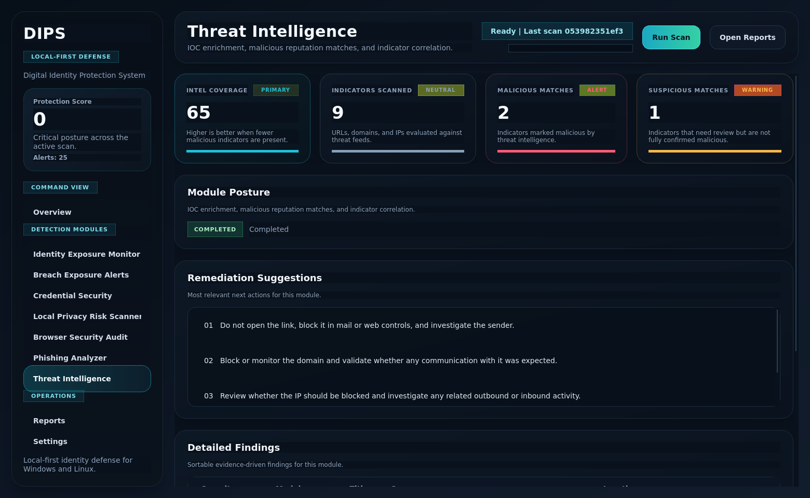

More screenshot details are in [screenshots/README.md](screenshots/README.md).

Refresh the full screenshot set with:

```bash
./.venv/bin/python screenshots/capture_dashboard_assets.py
```

## Installation

### Linux

```bash
git clone <your-repo-url>
cd digital-identity-protection-system
python3 -m venv .venv
source .venv/bin/activate
pip install -U pip
pip install -r requirements.txt
```

### Windows

```powershell
git clone <your-repo-url>
cd digital-identity-protection-system
py -3 -m venv .venv
.venv\Scripts\Activate.ps1
python -m pip install -U pip
pip install -r requirements.txt
```

Runtime-only desktop install:

```bash
pip install -e .[gui]
```

Full installation guidance is in [docs/installation.md](docs/installation.md).

Packaged release notes and downloadable assets live at [Latest release](https://github.com/kely26/digital-identity-protection-system/releases/latest).

## Downloads

The repository now includes a direct download folder in [downloads](downloads):

- full PDF user guide
- Debian `.deb` installer
- checksums for shipped artifacts

If you install the Debian package, validate the environment with:

```bash
dips doctor
```

## Quick Start

Run the example configuration:

```bash
dips scan --config config/example.config.json
```

Run a targeted fixture-backed scan:

```bash
dips scan \
  --path tests/fixtures/exposure \
  --email-file tests/fixtures/email/phish.eml \
  --password-file tests/fixtures/exposure/passwords.txt \
  --identifier security.user@example.com \
  --breach-dataset tests/fixtures/breach/offline_dataset.json \
  --threat-feed tests/fixtures/threat/malicious_feed.json
```

Launch the dashboard:

```bash
dips dashboard
```

Open an existing report in the dashboard:

```bash
dips dashboard --load-report reports/<scan-id>.json
```

The full operator quick start is in [docs/quickstart.md](docs/quickstart.md).

## Operational Readiness

Run the built-in environment diagnostics:

```bash
dips doctor
```

Get JSON diagnostics for support or managed rollouts:

```bash
dips doctor --doctor-format json
```

Use DIPS as an automation gate without changing the default scan workflow:

```bash
dips scan --path ~/Documents --fail-on-severity high
dips scan --path ~/Documents --fail-on-score 70
```

Operational guidance is in [docs/operations.md](docs/operations.md).

## Demo Mode

DIPS includes a safe synthetic demo mode for screenshots, GitHub presentation, and dashboard walkthroughs.

Generate the bundled demo reports locally:

```bash
dips demo
```

Launch the dashboard with staged demo data:

```bash
dips dashboard --demo
```

Load the committed sample incident report directly:

```bash
dips dashboard --load-report examples/demo-reports/demo-incident-003.json
```

Capture a screenshot in one step:

```bash
dips dashboard --demo --page overview --screenshot screenshots/dashboard-overview.png
```

Bundled sample demo reports live in [examples/demo-reports](examples/demo-reports).

## Example Reports

The repository also ships a curated example report pack in [examples/reports](examples/reports).

Included artifacts:

- example JSON scan report
- example HTML analyst report
- risk scoring summary
- alert findings example

Generate similar synthetic reports locally:

```bash
dips demo --output-dir examples/reports/generated
```

Generate real reports against your local environment:

```bash
dips scan --config config/example.config.json --output-dir reports
```

## CLI Usage

Show help:

```bash
dips --help
```

Core commands:

- `dips scan` runs one full defensive scan and writes reports.
- `dips watch` performs repeated foreground scans and shows new or resolved findings.
- `dips show-config` prints the merged effective configuration.
- `dips doctor` validates runtime health, writability, configured inputs, and plugin loading.
- `dips dashboard` launches the PySide6 desktop interface.

Examples:

```bash
dips show-config --config config/example.config.json
dips watch --config config/example.config.json --cycles 1 --interval 0
dips dashboard --load-report reports/<scan-id>.json --page overview
```

See [docs/cli.md](docs/cli.md) for the complete CLI guide.

## Dashboard Usage

The dashboard is designed to feel like a defensive SOC product while still reusing the same local scan engine as the CLI.

Key panels:

- Identity Protection Score
- Threat Intelligence Panel
- Security Event Timeline
- Alert Correlation View
- Risk Trend Graph
- Identity Exposure Map
- Severity Heatmap
- Reports and exports

Launch options:

```bash
dips dashboard
dips gui
dips-dashboard
```

Detailed workflow guidance is in [docs/gui.md](docs/gui.md).

## Reports

DIPS exports:

- JSON reports for automation, parsing, and integration
- standalone HTML reports for sharing and analyst review

Each report includes:

- scan metadata
- module findings and warnings
- Digital Identity Risk Score and label
- category scores and top recommendations
- timeline events and correlated patterns
- plugin extensions when present

Report structure details are in [docs/reports.md](docs/reports.md).

## Architecture Summary

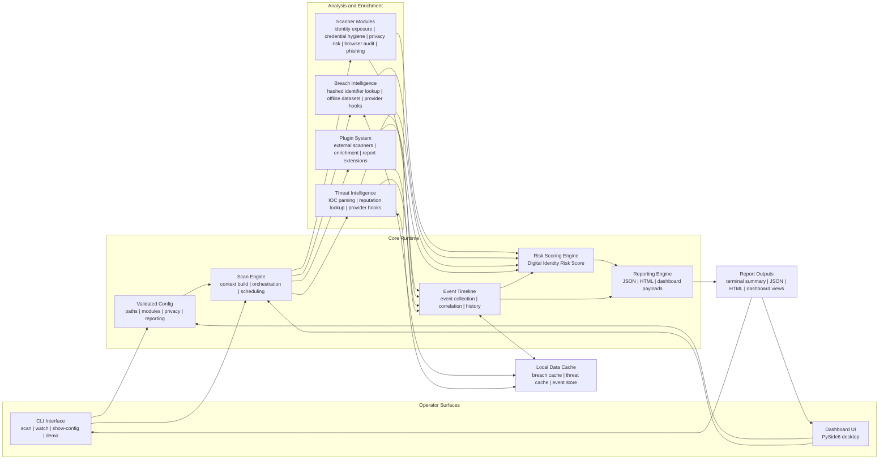

How to read it:

- Interfaces feed operator intent and runtime options into validated config and the scan engine.
- The scan engine builds context once, then dispatches built-in scanners, breach intelligence, threat intelligence, and any loaded plugins.
- Findings flow into the event timeline for correlation and into the risk engine for scoring.
- Local cache persists breach intel, threat intel, and timeline state without forcing cloud dependencies.
- The reporting layer turns the final analysis into terminal summaries, JSON reports, HTML reports, and dashboard-ready payloads.

Key layers:

- `dips.core`: config, engine, logging, timeline, plugin runtime, and risk engine
- `dips.scanners`: built-in local defensive scanners
- `dips.modules`: advanced enrichment modules such as breach, threat, and AI analysis
- `dips.reporting`: JSON and HTML exporters
- `dips.gui` and `dips.ui_dashboard`: desktop dashboard shell and public UI surface
- `plugins/`: local plugin root and example plugin

Deep-dive architecture notes are in [docs/architecture.md](docs/architecture.md).
The Mermaid source of truth is in [docs/architecture-diagram.mmd](docs/architecture-diagram.mmd).

## Repository Layout

| Path | Purpose |
| --- | --- |
| `dips/core/` | scan orchestration, config, logging, timeline, plugin runtime, and risk scoring |
| `dips/scanners/` | built-in local defensive scanners |
| `dips/modules/` | advanced modules such as breach intelligence, threat intelligence, and AI analysis |
| `dips/reporting/` | JSON and HTML report generation |
| `dips/ui_dashboard/` | stable public dashboard surface |
| `dips/gui/` | dashboard shell, state adapters, theme, and pages |
| `config/` | defaults and example configuration files |
| `examples/` | safe demo reports and usage-ready example flows |
| `screenshots/` | curated GitHub and release visuals |
| `docs/` | operator, engineering, and release documentation |
| `tests/` | automated regression, module, CLI, and dashboard coverage |
| `plugins/` | example plugin and local plugin root |

Documentation index: [docs/README.md](docs/README.md)

## Documentation At A Glance

- Start here: [docs/quickstart.md](docs/quickstart.md)
- CLI reference: [docs/cli.md](docs/cli.md)
- Dashboard guide: [docs/gui.md](docs/gui.md)
- Feature breakdown: [docs/features.md](docs/features.md)
- Architecture deep dive: [docs/architecture.md](docs/architecture.md)
- Plugin guide: [docs/plugins.md](docs/plugins.md)
- Release packaging: [docs/releasing.md](docs/releasing.md)
- Recruiter and GitHub positioning copy: [docs/project-profile.md](docs/project-profile.md)

## Testing

Install the contributor environment:

```bash
pip install -r requirements.txt
```

Run the quality checks:

```bash
pytest
ruff check .
python -m compileall dips tests
python -m build
```

More development guidance is in [CONTRIBUTING.md](CONTRIBUTING.md).

Release packaging guidance is in [docs/releasing.md](docs/releasing.md).

## Documentation Map

- [docs/installation.md](docs/installation.md)
- [docs/quickstart.md](docs/quickstart.md)
- [docs/features.md](docs/features.md)
- [docs/architecture.md](docs/architecture.md)
- [docs/cli.md](docs/cli.md)
- [docs/gui.md](docs/gui.md)
- [docs/reports.md](docs/reports.md)
- [docs/plugins.md](docs/plugins.md)
- [docs/module-development.md](docs/module-development.md)
- [docs/releasing.md](docs/releasing.md)
- [docs/troubleshooting.md](docs/troubleshooting.md)
- [docs/faq.md](docs/faq.md)

## Roadmap

The roadmap is organized around practical defensive capability growth rather than speculative feature sprawl. The goal is to keep DIPS local-first, privacy-respecting, and useful to both individual operators and larger security teams.

### Near-Term Priorities

- Additional threat intelligence sources with better feed health checks, per-provider trust scoring, and improved offline feed curation workflows.
- Improved phishing analysis for attachment triage, display-name impersonation, brand-lure detection, and better header anomaly correlation.
- Enhanced dashboard analytics with richer trend views, investigation pivots, filter presets, and cleaner analyst workflows for repeated scans.
- Broader plugin ecosystem support with better plugin templates, version compatibility checks, and more example integrations for defensive tools.

### Mid-Term Platform Expansion

- Enterprise deployment mode with centralized policy bundles, team-safe config profiles, and multi-endpoint report collection while preserving local analysis boundaries.
- Cloud monitoring integrations for approved defensive platforms such as SIEM, SOAR, and alert-routing systems using explicit opt-in connectors.
- More mature report comparison and longitudinal risk tracking so operators can see posture drift across weeks or incidents.
- Expanded local hardening coverage for identity stores, endpoint artifacts, and browser-risk posture across more enterprise environments.

### Longer-Term Engineering Goals

- Signed release artifacts and automated release pipelines for cleaner operator installation on Windows and Linux.
- Deeper dashboard investigation surfaces such as incident workspaces, richer alert correlation, and higher-density trend analytics for large report sets.
- A healthier external module ecosystem with stronger plugin validation, packaging guidance, and community-contributed scanner examples.
- Additional privacy-preserving enrichment paths that improve analyst context without turning the product into a cloud-first telemetry system.

For a more detailed milestone breakdown, see [docs/roadmap.md](docs/roadmap.md).

## Contribution Guide

Contributions are welcome if they keep the project defensive, privacy-respecting, and cross-platform.

Expected standards:

- add tests for behavior changes
- preserve Windows and Linux support
- redact sensitive evidence in examples and screenshots
- update documentation when CLI, config, dashboard, reporting, or plugin behavior changes

Start here:

- [CONTRIBUTING.md](CONTRIBUTING.md)
- [docs/module-development.md](docs/module-development.md)
- [docs/plugins.md](docs/plugins.md)

If you want recruiter-facing or GitHub presentation copy for the project page, pinned repo slot, resume, or LinkedIn post, use [docs/project-profile.md](docs/project-profile.md).

## Security and Privacy Principles

DIPS is built around a local-first, defensive security model. The tool is designed to improve identity-risk visibility without forcing users to trade away privacy just to understand their exposure.

Core principles:

- **Local-first security model:** the default path keeps scanning, analysis, reporting, and dashboard review on the local machine.
- **Privacy-respecting design:** exported evidence is redacted by default, demo assets use synthetic data, and sensitive identifiers are handled carefully.
- **Minimal external dependencies:** the core product remains useful without mandatory cloud services, with optional integrations only when the operator enables them.
- **Defensive security focus:** DIPS is for detection, explanation, remediation, and analyst visibility, not exploitation or weaponized workflows.
- **Safe handling of sensitive data:** bounded caches, safer file handling, controlled plugin loading, and careful output formatting reduce accidental disclosure.
- **Transparent reporting:** JSON, HTML, dashboard views, and scoring outputs are meant to show what was found, why it matters, and what to do next.

Why this matters:

- identity and browser findings can be highly sensitive
- privacy-focused users should not need to upload local data just to assess risk
- defensive security tooling should reduce risk, not create a second data-exposure problem

Full philosophy and rationale: [docs/security-philosophy.md](docs/security-philosophy.md)

Operational security guidance:

- [SECURITY.md](SECURITY.md)
- [docs/security-philosophy.md](docs/security-philosophy.md)
- [docs/troubleshooting.md](docs/troubleshooting.md)
- [docs/faq.md](docs/faq.md)

## Ownership and Attribution

Copyright (c) 2026 Hackloi.

This repository includes an explicit [LICENSE](LICENSE), [NOTICE](NOTICE), and [CITATION.cff](CITATION.cff) file so the project authorship, attribution expectations, and preferred citation are visible in the repository itself.

Important:

- public GitHub visibility helps prove authorship through commit history, release history, and repository metadata
- the MIT license preserves your copyright notice, but it still allows reuse
- if you want stronger control than MIT provides, move to a stricter license before broad distribution

## License

MIT. See [LICENSE](LICENSE).
