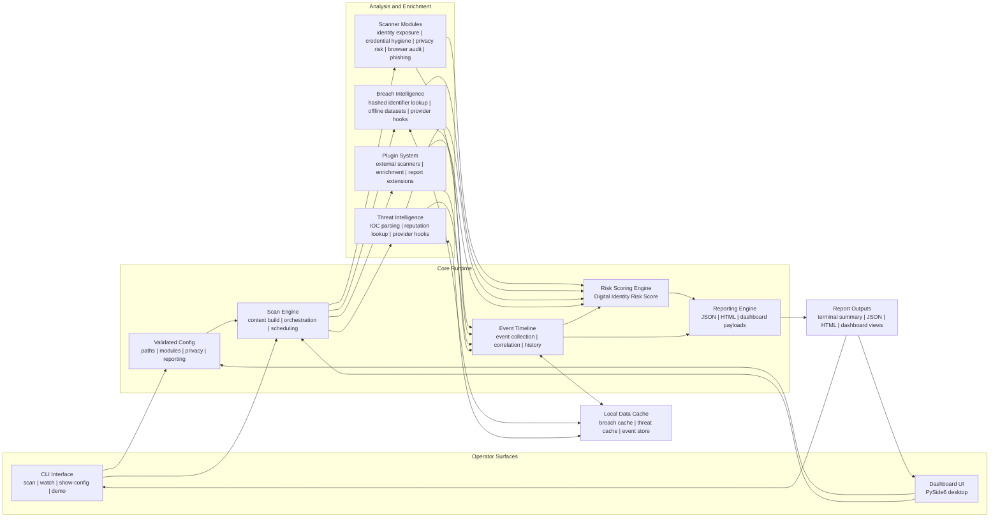

# Architecture Overview

## System Goals

DIPS is designed as a local-first defensive security platform with these engineering goals:

- clear module boundaries
- predictable CLI and dashboard behavior
- Windows and Linux compatibility
- privacy-respecting evidence handling
- extensibility through plugins and focused core services

## System Diagram

Recommended format for the repository: `mermaid`.

Why:

- GitHub renders Mermaid diagrams natively in `README.md` and docs.
- Developers can review and edit the diagram in plain text.
- The same Mermaid source can be exported to SVG later for slides, release notes, or portfolio pages.

Source of truth: [architecture-diagram.mmd](architecture-diagram.mmd)



## Data Flow Explanation

1. Operators interact through the CLI or the PySide6 dashboard UI.
2. Runtime options are merged through validated configuration before a scan begins.
3. The scan engine builds a shared context once, then dispatches scanner modules, intelligence modules, and any active plugins.
4. Findings from all modules feed the event timeline for chronological correlation and the risk engine for overall posture scoring.
5. Breach intelligence, threat intelligence, and timeline state persist through the local cache layer for privacy-preserving reuse.
6. The reporting engine produces terminal summaries, JSON reports, HTML reports, and dashboard-ready payloads.

## Runtime Flow

At runtime, DIPS follows a single consistent path regardless of whether a scan starts from the CLI or the desktop UI:

- configuration is merged and validated
- scan context is built once
- enabled modules execute against the shared context
- timeline and risk scoring post-process the results
- reports and dashboard payloads are produced from the same report object

## Main Subsystems

### `dips.core`

Responsible for:

- configuration loading and validation
- scan context construction
- orchestration and watch mode
- structured logging
- event timeline storage and correlation
- plugin loading and validation
- digital identity risk scoring

Important packages:

- `dips.core.config`
- `dips.core.context`
- `dips.core.engine`
- `dips.core.logging`
- `dips.core.event_timeline`
- `dips.core.plugin_system`
- `dips.core.risk_engine`

### `dips.scanners`

The built-in local scanner layer:

- identity exposure
- credential hygiene
- local privacy risk
- browser audit
- email and phishing analysis

These modules operate on the prepared `ScanContext` and avoid rewalking the filesystem when possible.

### `dips.modules`

Advanced enrichment and post-analysis modules:

- breach intelligence
- threat intelligence
- AI security analysis

These modules are kept separate from the baseline scanners because they represent specialized workflows, optional provider touchpoints, or cross-module reasoning.

### `dips.reporting`

Exports the final report into:

- machine-readable JSON
- standalone HTML

The report layer is designed to preserve structure while redacting sensitive values by default.

### `dips.gui` and `dips.ui_dashboard`

The dashboard layer is intentionally separated from scan execution:

- `dips.gui` contains the internal shell, pages, state transformation, worker runtime, and theme
- `dips.ui_dashboard` is the stable public surface for launching and reusing dashboard components

### `plugins/`

Local plugin root for external defensive modules. Plugins can:

- add scanner modules
- enrich results
- extend reports

## Repository Layout

```text
digital-identity-protection-system/
├── config/
├── dips/
│   ├── cli/
│   ├── core/
│   │   ├── event_timeline/
│   │   ├── plugin_system/
│   │   └── risk_engine/
│   ├── modules/
│   ├── reporting/
│   ├── scanners/
│   ├── ui_dashboard/
│   └── utils/
├── docs/
├── examples/
├── plugins/
├── screenshots/
└── tests/
```

## Configuration Model

Config sources merge in this order:

1. built-in defaults
2. optional JSON config file
3. CLI overrides

Key sections:

- `scan`
- `modules`
- `credential`
- `email`
- `breach_intelligence`
- `threat_intelligence`
- `event_timeline`
- `ai_security_analysis`
- `plugin_system`
- `reporting`
- `watch`

## Execution Model

### `scan`

- builds the context
- runs enabled modules
- enriches results
- builds timeline and score
- writes reports

### `watch`

- repeats the full scan loop
- compares report diffs across runs
- keeps using the same defensive runtime model

### `dashboard`

- launches the PySide6 interface
- can load existing reports or trigger live scans
- reuses the same scan engine instead of maintaining a separate analysis backend

## Security and Privacy Design

- local-first processing
- redacted reports by default
- hashed breach identifiers
- bounded local caches
- plugin validation before activation
- graceful error handling instead of raw end-user tracebacks

See [security-philosophy.md](security-philosophy.md) for the full design rationale behind these choices.

## Performance Notes

Current architecture includes targeted performance work for:

- candidate file discovery reuse
- offline breach dataset indexing
- dashboard payload caching
- report payload reuse across JSON and HTML export
- lightweight timing visibility for scan context building and report writing
