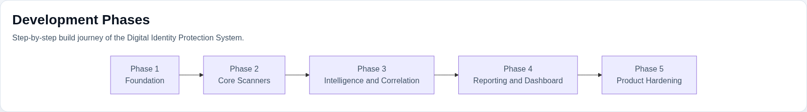

# Development Phases

This guide explains how DIPS was built step by step so a reviewer, recruiter, lecturer, or collaborator can understand the system evolution instead of only seeing the final repository state.

The project can be understood in five practical phases:

| Phase | Focus | Main Outcome |
| --- | --- | --- |
| 1 | Foundation and defensive scope | local-first architecture, config model, CLI entry points, and repository structure |
| 2 | Core scanning capabilities | identity, credential, privacy, browser, and phishing scanners |
| 3 | Intelligence and risk correlation | breach intelligence, threat intelligence, AI analysis, timeline, and scoring |
| 4 | Reporting and analyst experience | JSON and HTML reports, dashboard UX, demo mode, and screenshots |
| 5 | Product hardening and beta operations | diagnostics, policy gates, CI, release assets, and maintainer workflows |

## Phase Diagram

Mermaid source: [development-phases-diagram.mmd](development-phases-diagram.mmd)

## Phase 1: Foundation and Defensive Scope

The first phase established what kind of system DIPS would be: defensive-only, local-first, cross-platform, and modular enough to grow without turning into a single monolithic script.

What was built:

- scan orchestration and runtime models in `dips/core/`
- configuration handling in `dips/core/config.py`
- the central engine in `dips/core/engine.py`
- CLI-facing workflows in `dips/cli/`
- privacy and defensive design principles in [security-philosophy.md](security-philosophy.md)

Why this phase mattered:

- It defined the architectural boundaries early.
- It made later scanners and modules easier to plug into the same runtime.
- It established that DIPS was meant to be a maintainable product, not a one-off script.

## Phase 2: Core Scanning Capabilities

The second phase focused on the baseline security checks that make the platform useful even without online enrichment.

What was built:

- identity exposure scanning in `dips/scanners/identity_exposure.py`
- credential hygiene analysis in `dips/scanners/credential_hygiene.py`
- privacy-risk scanning in `dips/scanners/privacy_risk.py`
- browser posture review in `dips/scanners/browser_audit.py`
- email and phishing analysis in `dips/scanners/email_phishing.py`

Why this phase mattered:

- It created the practical defensive value of the system.
- It ensured DIPS could provide findings locally before any advanced intelligence steps.
- It made the project feel like a complete identity-risk tool rather than a framework with no operator surface.

## Phase 3: Intelligence and Risk Correlation

Once the baseline scanners existed, the project expanded into enrichment, correlation, and scoring so that findings could be interpreted instead of only listed.

What was built:

- breach intelligence in `dips/modules/breach_intelligence/`
- threat intelligence in `dips/modules/threat_intelligence/`
- AI analysis helpers in `dips/modules/ai_security_analysis/`
- event collection and timeline correlation in `dips/core/event_timeline/`
- risk scoring rules and severity modeling in `dips/core/risk_engine/`
- plugin hooks in `dips/core/plugin_system/`

Why this phase mattered:

- It moved DIPS from raw scanning into analyst-support tooling.
- It made cross-module findings more meaningful through scoring and timeline context.
- It opened the path for extensibility through plugins and future module growth.

## Phase 4: Reporting and Analyst Experience

After the engine and analysis layers were stable, the project focused on how operators consume the results.

What was built:

- JSON reporting in `dips/reporting/json_report.py`
- HTML reporting in `dips/reporting/html_report.py`
- dashboard shell and pages in `dips/gui/`
- reusable dashboard surface in `dips/ui_dashboard/`
- example reports in `examples/`
- screenshot assets and demo presentation material in `screenshots/`

Why this phase mattered:

- It turned technical findings into readable outputs for real users.
- It made the project suitable for demos, portfolio review, and analyst workflows.
- It created both an automation surface and a visual SOC-style investigation surface.

## Phase 5: Product Hardening and Beta Operations

The latest phase focused on making DIPS feel release-ready, supportable, and safe to evaluate in a real project setting.

What was built:

- runtime diagnostics with `dips/core/doctor.py`
- policy-gated scan exits in `dips/core/policy.py`
- CI workflows in `.github/workflows/`
- packaging and build metadata in `pyproject.toml`, `Makefile`, and release docs
- release assets in `downloads/`
- versioned release notes in `docs/releases/`

Why this phase mattered:

- It improved reliability for beta users and maintainers.
- It added stronger operational discipline around testing, verification, and support.
- It made the project easier to present as a serious engineering effort.

## Current Build Story in One Sentence

DIPS started as a local-first defensive scanning foundation, grew into a modular identity-risk analysis platform, then matured into a product-style security tool with analyst UX, release assets, and maintainable operations.

## Recommended Presentation Order

If you want to explain the project in a report, viva, or portfolio review, use this order:

1. Phase 1: define the problem and architecture boundaries
2. Phase 2: show the core scanners and what they detect
3. Phase 3: explain intelligence enrichment, scoring, and correlation
4. Phase 4: show reports, dashboard views, and screenshots
5. Phase 5: show testing, diagnostics, CI, and release readiness

## Related Documents

- [architecture.md](architecture.md): final system architecture and data flow
- [features.md](features.md): detailed module-level feature list
- [roadmap.md](roadmap.md): future evolution after the current phases
- [project-profile.md](project-profile.md): recruiter and presentation copy for the project
